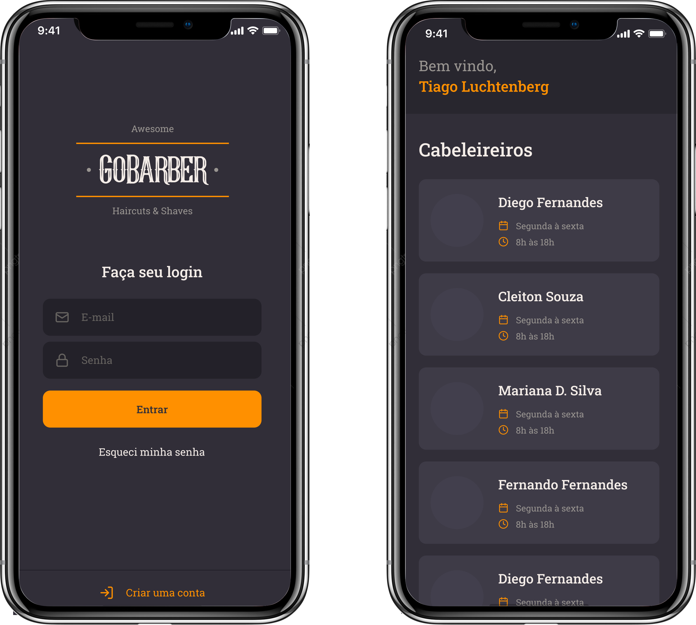

# GoBarber App

[](https://img.shields.io/node/v/react)


<p align="center">
  
</p>

#### O aplicativo GOBarber, permite realizar agendamento com cabeleireiros através de uma aplicação mobile, é possível também ver as datas e horários disponíveis, além de alterar dados de seu perfil.

### Funcionalidades:

- Mobile:
    1. Unform para automatização de Formulários
    2. Yup para validações de dados
    3. Context API para manter o estado especificos na aplicação toda, economizando requisições na api.
    4. Armazenamento do token no storage.

## Requisitos de instalação

- React >= 16.13.1
- React-Native >= 0.63.2
- npm >= 6.0.0
- node >= 10.0

## Iniciando o aplicativo Mobile

#### Execute o comando para instalações de dependências do Mobile:

```
yarn

ou

npm install
```

#### Execute o comando para iniciar o aplicativo:
> Certifique de configurar o emulador ou plugar o celular no computador

```
yarn android

ou

npm run android
```

ou

```
yarn ios

ou

npm run ios
```

Para que possa utilizar todas as funcionalidades do APP é necessário que a API esteje rodando, para isso  <a href="https://github.com/tsunodajapa/gobarber_backend"> clique aqui </a> e siga os passos descritos nele.
